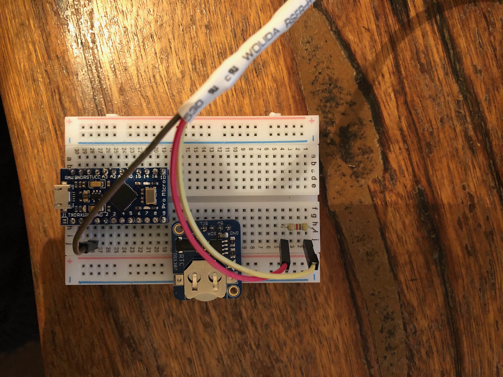

# Onsen Tamago Pro

# Instructions

```
Clock
GND - GND
5V - VCC
SDA - Pin 2
SCL - Pin 3

Display
Looking at it head on (buttons on the left bottom)
X
X
5V
X
GND
X
(space)
X
X
X
X
SDA
SCL

Temp
Brown - GND
Red - Resistor - 5V
Yellow - Resistor - Pin 4

Relay
White/+1in - Pin 5
Black 2-In - GND

```


```
Pro Micro
USB port facing towards row 30
Right row of pins in column g
Left row of pins in column c
Bottom most pins on row 30 (usb port) 
For example, the RAW pin is in C30 and pin 9 is in G19

RTC
Put so that GND pin in H11
and SQW is in H15
```


```
Temperature sensor
Brown cable to GND - j28
Yellow cable to J1
Red cable to J4
Resistor goes from H1 to H4, either direction. Press all the way down.
```



```
Hookup wires

RTC GND: G11 - I28 (RTC GND -> MCU GND) 
RTC 5V: G12 - B27 (RTC 5V -> MCU VCC)
RTC SDA: G13 - J26 (RTC SDA -> MCU 2)
RTC SCL: G14 - J25 (RTC SCL -> MCU 3)
TEMP DATA: G1 - J24 (TEMP DATA -> MCU 4)
TEMP 5V: G4 - F12 (TEMP 5V -> RTC 5V)
```


```
Display
Use the 4 female to male wire (orgnge, yellow, red, brown)
Hook the female ends to the display pins. With the display facing you and the 5 buttons on the bottom left, count the pins from the left:
1 - dont' connect
2 - don't connect
3 - hook up the red wire
4 - don't connect
5 - hook up the brown wire
6 - don't connect
(there's a space here)
7 - don't connect
8 - don't connect
9 - don't connect
10 - don't connect
11 - hook up the yellow wire (SDA)
12 - hook up the orange wire (SCL)
```


```
Now hook up the other ends to the board
Display 5V: Red cable to A27 (DISPLAY 5V -> MCU VCC)
Display GND: Brown cable to A29 (DISPLAY GND -> MCU GND)
Display SDA: Yellow cable to I26 (DISPLAY SDA -> MCU 2)
Display SCL: Orange cable to I25 (DISPLAY SCL -> MCU 3)
```


```

Now plug in the USB cable (only) into the Belkin power plug. You should see the screen light up, say ONSEN TAMAGO PRO, and then 
PRESET: (the current time)
Saucy: 06:00:00

If not, stop here and ask Brian

If so, try hitting the "up" arrow key (in the 4 keys that look like an arrow under the screen.)
The screen should turn red. The number on the right should be the temperature of the sensor, in celsius. Hold it in your hand or breathe on it to get it to go up.
If it doesn't, stop here and ask Brian
```


```

Now, take the white and black cables coming out of the PowerSSR Tail
White: J23 (TAIL -> MCU pin 5)
Black: J27 (TAIL GND -> MCU GND)

Plug in the rice cooker into the female end of the TAIL
Plug the male end of the TAIL into the Belkin power plug

Make sure the rice cooker has water in it, enough to cover an egg. 
Make sure the COOK/WARM switch is pressed "down".

Run the temperatue sensor through the hole in the top of the rice cooker and make sure the metal bit is inside the water.

```


